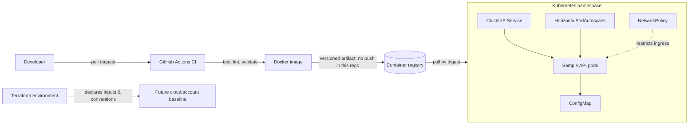

# DevOps Best Practices Reference Platform

[](../../actions/workflows/ci.yml)

A production-minded, cloud-neutral reference project that shows how a small HTTP service moves from source control to a container image, Kubernetes runtime, and an infrastructure-as-code foundation. It is intentionally safe to clone: **nothing here creates cloud resources or deploys automatically**.

## Why this repository exists

Hiring teams should be able to review a compact, opinionated example of practical DevOps engineering—not just a list of tools. This repository makes its choices visible: health checks, a non-root container, immutable image references, resource controls, CI quality gates, a least-privilege Kubernetes posture, and Terraform inputs that make environment differences explicit.

## Architecture



See the annotated diagram and design decisions in [`docs/architecture.md`](docs/architecture.md).

## Repository layout

```text
.
├── service/                         # Dependency-free Node.js sample API and tests
├── infrastructure/
│   ├── kubernetes/base/              # Kustomize-ready runtime manifests
│   └── terraform/                    # Cloud-neutral Terraform foundation and dev composition
├── .github/workflows/ci.yml          # Pull-request and main-branch quality gates
├── docs/                             # Architecture, decisions, and delivery plan
├── scripts/                          # Repeatable local validation
└── GIT_BEST_PRACTICES.md              # Existing Git workflow guidance
```

## Phased delivery plan

| Phase | Outcome | Status |
| --- | --- | --- |
| **1 — Foundation** | Documented architecture, sample service, hardened container, CI, Terraform skeleton, and Kubernetes baseline. | **Implemented** |
| **2 — Delivery** | Publish signed images, generate SBOM/provenance, add Helm/Kustomize environment overlays, and use GitOps pull-based promotion. | Planned |
| **3 — Platform controls** | Remote Terraform state, workload identity, secret manager integration, policy-as-code, observability, and alerting. | Planned |
| **4 — Operational excellence** | SLOs, load/failure testing, backup and recovery exercises, incident runbooks, cost dashboards, and progressive delivery. | Planned |

## Quick start

### Run the service locally

```bash
cd service
npm test
npm start
curl http://localhost:8080/healthz
```

The server binds to `PORT` (default `8080`) and returns a non-sensitive `SERVICE_NAME` value (default `sample-api`) from `/`.

### Build and run the container

```bash
docker build -t devops-sample-api:local service
docker run --rm --read-only --tmpfs /tmp -p 8080:8080 devops-sample-api:local
curl http://localhost:8080/readyz
```

The application image runs as an unprivileged user and exposes only port 8080. Do not place credentials in build arguments, image layers, manifests, or Terraform variables.

### Validate infrastructure safely

```bash
./scripts/validate.sh
```

This performs only local syntax/structure checks. Terraform is initialized with `-backend=false`; it does not authenticate to, plan against, or apply to any provider. Install Docker, Terraform, kubectl, and kubeconform to enable the corresponding optional checks.

## Deployment contract

Kubernetes manifests are intentionally **not** a deployment command. Before a real deployment, the platform owner must:

1. Replace the example image with a registry image pinned by digest.
2. Set the target namespace and configure registry/workload identity outside this repository.
3. Review resource requests, limits, replicas, HPA thresholds, PDB, and NetworkPolicy against the target cluster.
4. Apply an environment-specific Kustomize overlay through an approved GitOps or CI/CD promotion process.

## Engineering guardrails

- CI tests the service, validates Terraform formatting/configuration, checks Kubernetes manifests, and builds the image without pushing it.
- The container uses a minimal production base image, `NODE_ENV=production`, a fixed non-root UID, no Linux capabilities, and a read-only runtime filesystem in Kubernetes.
- Kubernetes includes startup/liveness/readiness probes, resource controls, HPA, PDB, and default-deny ingress with explicit HTTP ingress.
- Terraform sets required version constraints and passes consistent owner/environment/cost-center labels through a reusable module. It contains no credentials, backend, provider configuration, or billable resources.

## Security and contribution notes

Never commit secrets. Use secret-manager references and workload identity in a real environment; do not substitute plaintext Kubernetes `Secret` files. Keep pull requests small, run `./scripts/validate.sh`, and follow [`GIT_BEST_PRACTICES.md`](GIT_BEST_PRACTICES.md).

## License

Add a license appropriate for your organization before external distribution.
