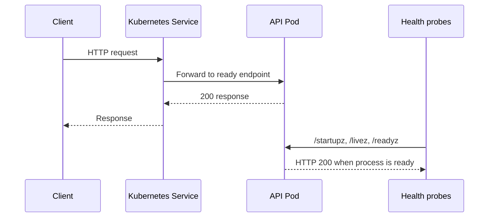

# Reference architecture

## Scope and boundary

Phase 1 is a reviewable foundation, not an automated cloud deployment. The service, container, Kubernetes base, and Terraform composition demonstrate the interfaces a delivery platform needs while deliberately omitting credentials, remote state, cluster access, registry publication, and `apply` steps.

## Runtime flow

## Design decisions

| Decision | Rationale |
| --- | --- |
| Dependency-free Node HTTP service | Keeps the example easy to audit and test while concentrating the project on operational patterns. |
| Separate startup, liveness, and readiness endpoints | Lets Kubernetes distinguish initialization failures, dead processes, and traffic eligibility. |
| Non-root image and read-only pod filesystem | Reduces the blast radius of a compromised workload. |
| Digest-pinned production image contract | Prevents a mutable tag from silently changing the artifact that reaches an environment. |
| Kustomize base with no environment overlay | Makes shared safeguards reusable; actual environment decisions remain explicit and reviewable. |
| Terraform module with no providers or resources | Establishes a portable contract now without creating, billing for, or coupling to a cloud account. |

## Trust boundaries

GitHub Actions is allowed to build and validate source artifacts only. In a later phase, an OIDC-enabled deployment identity should be scoped to a single environment and used by a GitOps controller. Runtime pods should receive only the service account, network paths, and secret references they require.

## Promotion model for Phase 2

1. CI builds an image from a protected branch, produces an SBOM and provenance, and signs the digest.
2. A reviewable configuration change promotes that digest through environment overlays.
3. A GitOps controller reconciles the approved desired state; CI does not hold broad cluster-admin credentials.
4. Runtime telemetry and rollout health determine whether progressive delivery proceeds or rolls back.
